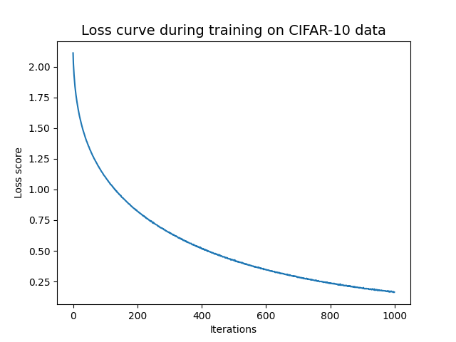

# Assignment 2: Classification Benchmarks with Logistic Regression and Neural Networks
This repository contains Python-based scripts for building and evaluating classification models on the CIFAR-10 dataset using two approaches:
- **Logistic Regression Classifier:** Employs logistic regression to classify images from the dataset.  
- **Neural Network Classifier:** Employs a neural network, specifically a Multi-layer Perceptron (MLP), to classify images.  

More specifically, the repository contains two Python scripts - one for each classifier - output files for classification reports along with a plot of the loss curve during training for the NN, and finally, other relevant files for setting up and running the script (for further details, see *Repository structure*).

### Task Overview
For this assignment, the main objective was to create and evaluate two classification models using the CIFAR-10 dataset (see *Data Source*). 
The code had to be able to do the following:
1. Load the CIFAR-10 dataset.
2. Preprocess the data (i.e., convert to greyscale, normalise, and reshape).
3. Train two different classifiers: A logistic regression classifier and a neural network classifier (MLPClassifier).
4. For both classifiers, save a classification report.
5. Save a plot of the loss curve during training (only for the NN classifier).
6. Evaluate the two models' performances.

### Repository Structure
Below is the directory structure of the repository. Make sure to have a similar layout for easy navigation and reproducibility purposes.
```
.
Assignment_2/
│
├── in/  
│
├── out/
│   ├── logistic_regression_report.txt
│   ├── loss_curve_nnw.png
│   ├── neural_network_report.txt
│
├── src/
│   ├── logistic_reg_classification.py
│   ├── neural_network_classification.py
│
├── README.md
├── requirements.txt
├── run.sh
└── setup.sh
```

## Data Source
The data used for this assignment is a collection of 60,000 32x32 colour images contained across 10 different classes, with 6000 images per class, called the CIFAR-10 dataset. Specifically, the classes contained in the dataset are:
- airplane
- automobile
- bird
- cat
- deer
- dog
- frog
- horse
- ship
- truck  

For more details about the data, visit the following [website](https://www.cs.toronto.edu/~kriz/cifar.html). To use the data, ensure that the `cifar10` module from `tensorflow.keras.datasets` is loaded. Note that this should happen by simply running the scripts.

## Steps for Re-running the Analysis
### Setting Up and Running the Code
To re-run the analysis, follow the steps outlined below:

**1. Download and Prepare the Repository:**  
If the attachment has not already been downloaded and unzipped, then start by downloading the zip file and unzip it in your desired location. When done, navigate to the `Assignment_2` folder.  

**2. Set Up the Virtual Environment:**  
Execute the following command in your terminal to set up the Python virtual environment and install the needed dependencies.
```
bash setup.sh 
```
**3. Activate the Virtual Environment and Run the Code:**  
Run the script by executing the following command in your terminal. It will activate the virtual environment, run the chosen Python script with the command line arguments that you provide, and then deactivate the environment when finished.
```
bash run.sh [script_name] --output_dir=./out
```
Replace [script_name] with either **'logistic_reg_classification.py'** or **'neural_network_classification.py'** to choose which script to run.

### Command Line Arguments
This is the single arg that can be passed:  
**--output_dir:** Optional. Directory where the results (i.e., classification reports and loss curve plot) will be saved, defaults to ../out.  

## Summary of Key Points from Outputs
The outputs for both the logistic regression and neural network classifiers are presented below.  

**Logistic Regression Classifier:**  
| Class       | Precision | Recall | F1-score | Support |
|-------------|-----------|--------|----------|---------|
| airplane    | 0.32      | 0.37   | 0.34     | 1000    |
| automobile  | 0.27      | 0.28   | 0.27     | 1000    |
| bird        | 0.21      | 0.16   | 0.18     | 1000    |
| cat         | 0.17      | 0.13   | 0.15     | 1000    |
| deer        | 0.19      | 0.16   | 0.18     | 1000    |
| dog         | 0.26      | 0.25   | 0.26     | 1000    |
| frog        | 0.20      | 0.18   | 0.19     | 1000    |
| horse       | 0.23      | 0.24   | 0.23     | 1000    |
| ship        | 0.31      | 0.36   | 0.33     | 1000    |
| truck       | 0.31      | 0.41   | 0.35     | 1000    |
| **Accuracy**|           |        | **0.25** | 10000   |
| **Macro Avg**| 0.25     | 0.25   | 0.25     | 10000   |
| **Weighted Avg**| 0.25  | 0.25   | 0.25     | 10000   |  

The logistic regression classifier got an overall accuracy of 25% on classifying the images from CIFAR-10 test dataset. The precision, recall, and F1-scores for most classes are rather low, with the highest precision scores being in the 'airplane', 'truck', and 'ship' classes.

**Neural Network Classifier:**
| Class       | Precision | Recall | F1-score | Support |
|-------------|-----------|--------|----------|---------|
| airplane    | 0.31      | 0.31   | 0.31     | 1000    |
| automobile  | 0.29      | 0.30   | 0.30     | 1000    |
| bird        | 0.22      | 0.24   | 0.23     | 1000    |
| cat         | 0.18      | 0.16   | 0.17     | 1000    |
| deer        | 0.18      | 0.17   | 0.18     | 1000    |
| dog         | 0.25      | 0.25   | 0.25     | 1000    |
| frog        | 0.23      | 0.22   | 0.23     | 1000    |
| horse       | 0.25      | 0.26   | 0.25     | 1000    |
| ship        | 0.33      | 0.37   | 0.35     | 1000    |
| truck       | 0.28      | 0.23   | 0.25     | 1000    |
| **Accuracy**|           |        | **0.25** | 10000   |
| **Macro Avg**| 0.25     | 0.25   | 0.25     | 10000   |
| **Weighted Avg**| 0.25  | 0.25   | 0.25     | 10000   |  

The neural network classifier also got an overall accuracy of 25% on classifying the images from the CIFAR-10 test dataset. Additionally, like the logistic regression classifier, the performance metrics across the 10 different classes are rather low, consistently so, with the 'ship' and 'airplane' classes being the only ones to get above 0.30 in precision.

**Loss Curve for Neural Network Training:**



The loss curve above shows a clear decrease in loss score over the 1000 iterations, suggesting consistent learning and convergence during training. However, while the decrease from the initial loss value of 2.0 to 0.25 does mean that the model improved, in the context of the CIFAR-10 dataset it still indicates room for better model accuracy and performance.

## Discussion of Limitations and Possible Steps for Improvement
The two scripts offer insights into the challenges and limitations associated with employing somewhat simple models for classifying images from a complex dataset like CIFAR-10.

Firstly, both the logistic regression and the neural network classifiers got relatively low accuracies (25%). Such performances are notably lower than the usual performances of more complex models used for classification tasks. Moreover, the CIFAR-10 dataset contains complex images with varied visual features, which can make it hard for simpler models to perform well.

To possibly improve the models and their overall classification accuracy, the following should be considered:  

In terms of model complexity, the logistic regression model has proven to be limited in its ability to accurately classify images. Therefore, for future iterations of the script, more complex models should be considered. For instance, convolutional neural networks (i.e., CNNs) could be implemented instead, as CNNs are designed to handle image data well. When considering the neural network and its improvement, future iterations should focus on experimenting with increasing the number of hidden layers and units (the current NN has one hidden layer with 64 units).

Additionally, whether or not to employ data augmentation in future versions of the scripts should also be given thought. By augmenting the training data with various transformations such as flips, rotations, and colour adjustments (if greyscaling is disregarded) the models could become more robust, and thus likely improve their performance as well.

In short, while the current two scripts provide foundational approaches to image classification, it is most likely necessary to first address the above limitations and implement the suggested improvements before the scripts will perform with better effectiveness and accuracy.

