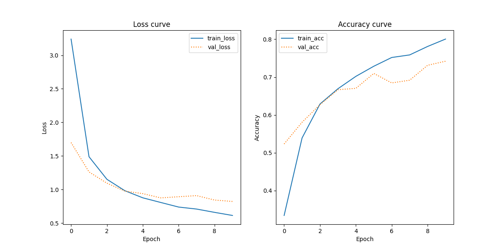

# Assignment 3: Document Classification Using Pretrained Image Embeddings
This repository contains a Python-based document classification script that predicts document types based on their visual features. The approach uses a pre-trained Convolutional Neural Network (CNN) model, namely the VGG16, to extract image embeddings for classification.  

More specifically, the repository contains the main Python script, an output classification report and a plot showing the learning curves for the trained classifier, and other files for setting up and running the script (for further details, see *Repository structure*).

### Task Overview
For this assignment, the main objective was to predict the type of document based solely on its visual appearance using the Tobacco3482 dataset (see *Data Source*).  
The code had to be able to do the following:
1. Load the Tobacco3482 dataset.
2. Generate labels for each image.
3. Train a CNN-based classifier to predict document type based on visual features.
4. Output a classification report and a plot of learning curves for the trained classifier.
5. Save the results in the `out` folder.

### Repository Structure
Below is the directory structure of the repository. Make sure to have a similar layout for easy navigation and reproducibility purposes.  
```
.
Assignment_3/
│
├── in/
│   └── Tobacco3482/
│       ├── ADVE/
│       ├── Email/
│       ├── ...
│
├── out/
│   ├── Classification_Report.txt
│   ├── Learning_Curves.png
│
├── src/
│   └── main.py
│
├── README.md
├── requirements.txt
├── run.sh
└── setup.sh
```

## Data Source
The dataset used for this assignment is the Tobacco3482 dataset, a collection of over 3000 document images contained across 10 different classes. Specifically, the 10 classes in the dataset are:  
- ADVE
- Email
- Form
- Letter
- Memo
- News
- Note
- Report
- Resume
- Scientific  

For more details about the data, visit the following [website](https://www.kaggle.com/datasets/patrickaudriaz/tobacco3482jpg?resource=download). To use the data, simply follow the link, download the dataset, and save it to the `in` folder.

## Steps for Re-running the Analysis
### Setting Up and Running the Code
To re-run the analysis, follow the steps outlined below:

**1. Download and Prepare the Repository:**  
If the attachment has not already been downloaded and unzipped, then start by downloading the zip file and unzip it in your desired location. When done, navigate to the `Assignment_3` folder.  
(Ensure that the Tobacco3482 dataset is downloaded and placed in the `in` folder, as specified above.)

**2. Set Up the Virtual Environment:**  
Execute the following command in your terminal to set up the Python virtual environment and install the needed dependencies.
```
bash setup.sh 
```

**3. Activate the Virtual Environment and Run the Code:**  
Run the script by executing the following command in your terminal. It will activate the virtual environment, run the Python script with the command line arguments that you provide, and then deactivate the environment when finished.
```
bash run.sh --dataset_path=./in/Tobacco3482 --output_dir=./out --batch_size=<batch_size> --epochs=<epochs>
```

### Command Line Arguments
These are the four different args that can be passed:  
**--dataset_path:** Path to the dataset directory containing the folder with images.  
**--output_dir:** Optional. Directory where the results (classification report and learning curves) will be saved, defaults to ../out.  
**--batch_size:** Optional. Batch size for training and evaluation, defaults to 128.  
**--epochs:** Optional. Number of epochs to train the model, defaults to 10.

## Summary of Key Points from Outputs
The outputs for the document classification task, based on the Tobacco3482 dataset, are presented below.  

**Classification Report:**  
| Class       | Precision | Recall | F1-score | Support |
|-------------|-----------|--------|----------|---------|
| ADVE        | 0.86      | 0.93   | 0.90     | 46      |
| Email       | 0.88      | 0.91   | 0.89     | 120     |
| Form        | 0.77      | 0.70   | 0.73     | 86      |
| Letter      | 0.75      | 0.54   | 0.63     | 114     |
| Memo        | 0.56      | 0.84   | 0.67     | 124     |
| News        | 0.91      | 0.79   | 0.85     | 38      |
| Note        | 0.70      | 0.78   | 0.74     | 40      |
| Report      | 0.47      | 0.49   | 0.48     | 53      |
| Resume      | 0.86      | 0.50   | 0.63     | 24      |
| Scientific  | 0.58      | 0.35   | 0.43     | 52      |
| **Accuracy**|           |        | **0.71** | 697     |
| **Macro Avg**| 0.73     | 0.68   | 0.70     | 697     |
| **Weighted Avg**| 0.72  | 0.71   | 0.71     | 697     |  

The report shows that the classifer managed an overall accuracy of 71% on the test set, demonstrating an adequate, above chance, level of performance for the task. The other scores - precision, recall, and F1-scores - are generally also high, but vary across the different document classes. Two classes, 'ADVE' and 'Email', show high precision and recall scores, suggesting that these two document classes are effectively identified by the model. However, the 'Report' and 'Scientific' classes display notably lower precision and recall scores. This indicates that the model also has difficulty distinguishing some of the classes from the others, perhaps due to similarity in visual features or class imbalances.

**Learning Curves:**  


The learning curves above display the loss and accuracy trends over 10 epochs for both the training and validation sets. For the loss curve, the training loss decreases steadily - displaying consistent learning - whereas while the validation loss also decreases initially it then begins to plateau and very slightly increase towards the end. This may suggest possible overfitting or simply nearing the model's capacity toward the end. For the accuracy curve, both the training and validation accuracy increases over the epochs. More specifically, the training accuracy seems to continually improve while the validation accuracy plateaus around 70%. These trends correspond pretty well with the overall accuracy shown in the classification report.

## Discussion of Limitations and Possible Steps for Improvement
This script provides insights into document classification using visual features. However, certain limitations should be considered to further enhance the model's performance in the future.  

First and foremost, a limitation to consider is the likely imbalance in the dataset. As shown in the classification report, notable variations in precision, recall, and F1-scores are present across the different document classes. For example, the 'Report' and 'Scientific' classes show lower precision and recall, suggesting, as mentioned above, that the model struggles with these classes. These differences could likely be because of the imbalanced nature of the dataset, where some classes have more samples than others, thus leading to biased learning. To address this, class weights could be applied during model training to make up for the differences, giving more weight to the 'smaller' classes.

Another limitation to take into account, is the slight diversion between training and validation loss shown in the loss curves. As previously pointed out, this trend might suggest overfitting to the training data and not generalising as well to unseen/unknown data. Different regularisation techniques (e.g., adding dropout layers in the custom layers of the model) might help mitigate some of these potential overfitting problems. Additionally, data augmentation such as rotating and flipping images could also be implemented to improve the model's generalisation ability.  

Finally, it could also enhance the script to improve some of the code. For instance, the 'load_image_data' function sequentially loads and processes each image, which for larger datasets can be very time-consuming. For future iterations of the script, employing parallel processing instead could be wise.

In short, while the current script demonstrates adequate to good document classifications of documents, addressing the discussed limitations and implementing the suggested improvement strategies could lead to a more robust and accurate model. This model could additionally be better at generalising across different datasets and document types.

## Acknowledgements
For this assignment, the author thanks Sabrina Zaki Hansen for her helpful input on coding structure.