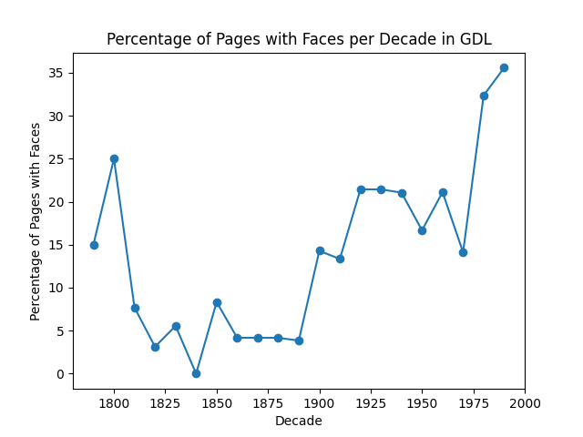
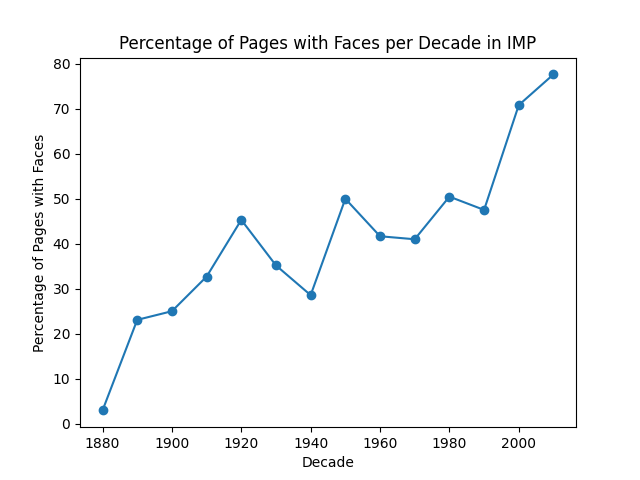
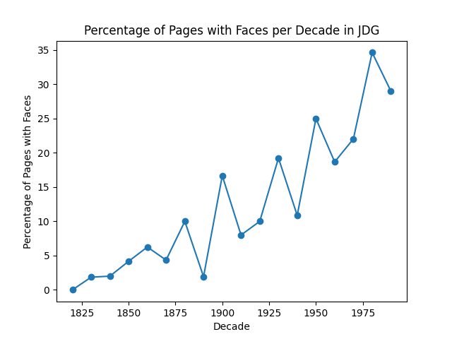

# Assignment 4: Detecting Faces in Historical Newspapers
This repository contains a Python script designed to detect human faces in historical Swiss newspapers and analyse the prevalence of images with human faces over time. 

More specifically, the repository contains the main Python script, output CSV files of the newspapers face counts (among other details) and plots of pertentage of pages with faces per decade for each newspaper, and other relevant files for setting up and running the script (for further details, see *Repository structure*).

### Task Overview
For this assignment, the main objective was detect faces in pages of three historical Swiss newspapers: the 'Gazette de Lausanne' (GDL, 1804-1991), the 'Impartial' (IMP, 1881-2017), and the 'Journal de Genève' (JDG, 1826-1994) (for further details, see *Data Source*). The code had to be able to do the following:   
1. For each of the three newspapers, detect if faces are present in the pages using a pre-trained CNN model.  
2. Aggregate the results by decade.  
3. For each newspaper, generate a CSV file showing the total number of faces per decade and the percentage of pages with faces for that decade.  
4. For each newspaper, create a plot showing the percentage of pages with faces per decade.

### Repository Structure
Below is the directory structure of the repository. Make sure to have a similar layout for easy navigation and reproducibility purposes.  
```
.
Assignment_4/
│
├── in/
│   └── newspapers/
│       ├── GDL/
│       ├── IMP/
│       ├── JDG/
│           ├── JDG-1826-02-16-a-p0001.jpg
│           ├── ...
│
├── out/
│   ├── GDL_face_counts.csv
│   ├── GDL_faces_plot.png
│   ├── IMP_face_counts.csv
│   ├── IMP_faces_plot.png
│   ├── JDG_face_counts.csv
│   ├── JDG_faces_plot.png
│
├── src/
│   └── main.py
│
├── README.md
├── requirements.txt
├── run.sh
└── setup.sh
```

## Data Source
The dataset used for this assignment is a collection historic Swiss newspapers, namely the 'Gazette de Lausanne' (GDL, 1804-1991); the 'Impartial' (IMP, 1881-2017); and the 'Journal de Genève' (JDG, 1826-1994). Images of the newspaper pages (.jpg) are contained within and are sorted by which newspaper they belong to along with the year-month-date of publication. There are therefore three sub-folders in the dataset:
- GDL
- IMP
- JDG

For more details about the data, visit the following [website](https://zenodo.org/records/3706863). To use the data, simply follow the link, download the dataset for the images, and save it to the `in` folder.

## Steps for Re-running the Analysis
### Setting Up and Running the Code
To re-run the analysis, follow the steps outlined below:

**1. Download and Prepare the Repository:**  
If the attachment has not already been downloaded and unzipped, then start by downloading the zip file and unzip it in your desired location. When done, navigate to the `Assignment_4` folder.  
(Ensure that the dataset of images is downloaded and placed in the `in` folder, as specified above.)

**2. Set Up the Virtual Environment:**  
Execute the following command in your terminal to set up the Python virtual environment and install the needed dependencies.
```
bash setup.sh 
```

**3. Activate the Virtual Environment and Run the Code:**  
Run the script by executing the following command in your terminal. It will activate the virtual environment, run the Python script with the command line arguments that you provide, and then deactivate the environment when finished.
```
bash run.sh --dataset_path=./in/newspapers --output_dir=./out
```

### Command Line Arguments
These are the two args that can be passed:  
**--dataset_path:** Path to the directory containing the sub-folder with images.  
**--output_dir:** Optional. Directory where the results CSV and plots will be saved, defaults to ../out.  

## Summary of Key Points from Outputs
The outputs for the face detection analysis are presented below.  

**Gazette de Lausanne (GDL):**  
| Decade | Total Faces | Percentage Pages with Faces |
|--------|-------------|-----------------------------|
| 1790   | 3           | 15.0%                       |
| 1800   | 10          | 25.0%                       |
| 1810   | 2           | 7.69%                       |
| 1820   | 1           | 3.13%                       |
| 1830   | 2           | 5.56%                       |
| 1840   | 0           | 0.0%                        |
| 1850   | 2           | 8.33%                       |
| 1860   | 1           | 4.17%                       |
| 1870   | 1           | 4.17%                       |
| 1880   | 1           | 4.17%                       |
| 1890   | 1           | 3.85%                       |
| 1900   | 4           | 14.29%                      |
| 1910   | 4           | 13.33%                      |
| 1920   | 8           | 21.43%                      |
| 1930   | 8           | 21.43%                      |
| 1940   | 10          | 21.05%                      |
| 1950   | 8           | 16.67%                      |
| 1960   | 25          | 21.11%                      |
| 1970   | 14          | 14.10%                      |
| 1980   | 60          | 32.35%                      |
| 1990   | 115         | 35.58%                      |  

For the GDL newspaper, the data reveals a somewhat fluctuating pattern in the percentage of pages with faces. There are surprisingly rather high percentages in the 1800s (i.e., 25.0%) and early to mid-1900s (i.e., around 21%), followed by a decline in the mid-20th century. An increase is then present again in the late 20th century, with 32.35% in the 1980s and 35.58% in the 1990s, fitting with the fact that cameras become more prevalent over the years.

**Impartial (IMP):**  
| Decade | Total Faces | Percentage Pages with Faces |
|--------|-------------|-----------------------------|
| 1880   | 1           | 2.94%                       |
| 1890   | 17          | 23.08%                      |
| 1900   | 25          | 25.0%                       |
| 1910   | 27          | 32.69%                      |
| 1920   | 46          | 45.31%                      |
| 1930   | 31          | 35.19%                      |
| 1940   | 24          | 28.57%                      |
| 1950   | 105         | 50.0%                       |
| 1960   | 175         | 41.67%                      |
| 1970   | 202         | 41.0%                       |
| 1980   | 343         | 50.48%                      |
| 1990   | 210         | 47.52%                      |
| 2000   | 657         | 70.83%                      |
| 2010   | 699         | 77.66%                      |

The IMP newspaper displays a more dramatic increase in the percentage of pages with faces over time, although notably, the earliest decade is the 1880s and the latest is the 2010s. Beginning with only one face in the pages in the 1880s, there is a notable rise by the 1950s with 50.0% of pages having faces in them. By the 2000s, almost 71% of pages have faces in them.

**Journal de Genève (JDG):**  
| Decade | Total Faces | Percentage Pages with Faces |
|--------|-------------|-----------------------------|
| 1820   | 0           | 0.0%                        |
| 1830   | 1           | 1.85%                       |
| 1840   | 1           | 2.0%                        |
| 1850   | 2           | 4.17%                       |
| 1860   | 4           | 6.25%                       |
| 1870   | 5           | 4.35%                       |
| 1880   | 6           | 10.0%                       |
| 1890   | 1           | 1.92%                       |
| 1900   | 11          | 16.67%                      |
| 1910   | 6           | 8.0%                        |
| 1920   | 21          | 10.0%                       |
| 1930   | 32          | 19.23%                      |
| 1940   | 13          | 10.87%                      |
| 1950   | 49          | 25.0%                       |
| 1960   | 44          | 18.67%                      |
| 1970   | 48          | 22.04%                      |
| 1980   | 143         | 34.64%                      |
| 1990   | 190         | 29.01%                      |  

The JDG newspaper displays a gradual increase in the percentage of pages with faces in them from the 1820s to the 1980s. Notably, there are low percentages of pages with faces in the early decades (i.e., 0% in the 1820s, 1.85% in the 1830s), but then from the 1900s onward there is a steady increase.

**Plots**  
The results discussed above are also visually presented in the plots below, showing how the percentage of newspaper pages with faces in them fluctuated throughout the decades, but overall increased when compared to the earlier decades.  

 
 
 

## Discussion of Limitations and Possible Steps for Improvement
This script offers some insights into the prevalence of faces in three historical Swiss newspapers, yet there are several limitations and potential improvements to consider before drawing any final conclusions about how the pervasiveness of faces have changed over time.  

First of all, the model used (i.e., MTCNN) for face detection, while functional, may not be optimised and/or good for historical newspaper images due to variations in e.g. print styles, degradation of older prints, other noise/artifacts in the images from scanning the papers, and overall image quality. Future iterations of this script could therefore look into fine-tuning the model specifically on historical datasets or employing alternative models made for low-quality images. Another improvement could also be to implement preprocessing steps, such as noise reduction and overall image enhancement, to help improve face detection accuracy.  

Another point to note is that the number of pages per decade is not always the same across newspapers. For example, while it looks like there are, percentage-wise, a lot of pages with faces in the GDL's early decades, there may just not be that many pages in total in the dataset for those decades. Consequently, the ones that are available may contain a comparatively high number of faces. However, here it is important to also point out that a visual inspection of the data revealed that the script - in some cases - seemingly falsely identifies faces. For instance, in the GDL newspapers, three and 10 faces were detected from the 1790s and 1800s respectively, but in reality, there were no faces present. This might suggest that the script sometimes misclassifies visual noise or other clutter as faces. This indicates that the current model struggles with always accurately identifying faces and not all the outputs should be considered totally accurate.

Finally, it should be noted that when running the script, truncation errors have been encountered for a few of the images across the three newspapers. However, these errors are currently being handled by the 'detect_faces' function, which allows for the process to continue by returning zero faces for any images associated with these errors. Future iterations could with benefit consider to implement parallel processing instead of the current way of loading and processing the images, which could help reduce the processing time and intensive computational load.

In short, while the current script offers a soild foundation for attempting to detect faces in historical newspapers along with analysing relevant trends, addressing the above limitations would most importantly enhance its accuracy, and therefore robustness and broader applicability.

